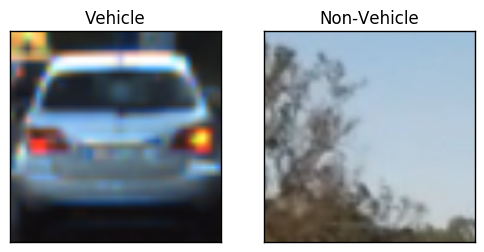
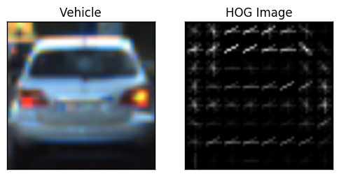
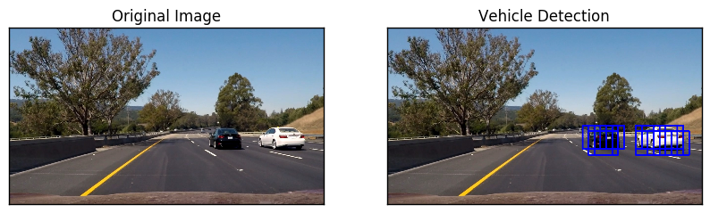
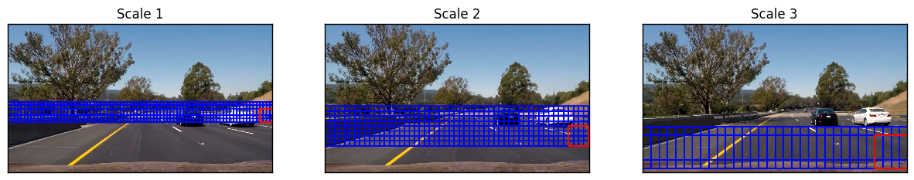
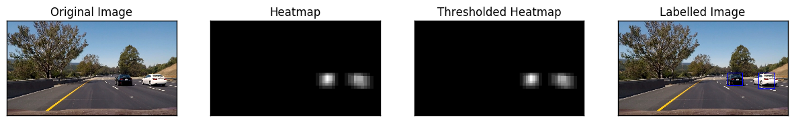
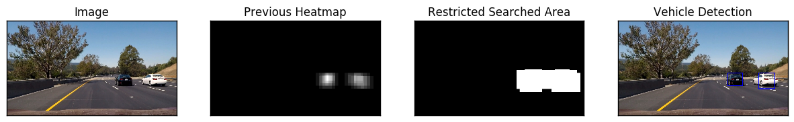

# Vehicle Detection Project Report

***

_This file was generated using [this jupyter notebook](./Vehicle-Detection.ipynb) and code for the images used in this report can be found in the same._

## Goal and Objective
---

The goals / steps of this project are the following:

* Perform a Histogram of Oriented Gradients (HOG) feature extraction on a labeled training set of images and train a classifier Linear SVM classifier.
* Optionally, you apply color transform and append binned color features, to HOG feature vector. 
* Train a classifier to disinguish between car and non-car images
* Implement a sliding-window technique and use your trained classifier to search for vehicles in images.
* Run vehicle detection pipeline on a video stream and create a heat map of recurring detections frame by frame to reject outliers and follow detected vehicles.
* Estimate a bounding box for vehicles detected.

## Model Training
---
_The jupyter notebook containing code for model training can be [found here](./Vehicle-Detection-Model-Training.ipynb)._


### 1.  HOG features

The code for HOG feature extraction can be found in `./utils/featureExtraction.py`.  

I started by reading in all the `vehicle` and `non-vehicle` images.  Here is an example of one of each of the `vehicle` and `non-vehicle` classes:





I then explored different color spaces and different `skimage.hog()` parameters (`orientations`, `pixels_per_cell`, and `cells_per_block`).  I grabbed random images from each of the two classes and displayed them to get a feel for what the `skimage.hog()` output looks like.

Here is an example using the `YCrCb` color space and HOG parameters of `orientations=8`, `pixels_per_cell=(8, 8)` and `cells_per_block=(2, 2)`:





### 2. Feature Extraction for Model

I tried various combinations of color spaces and parameters before finally settling with following:

```
color_space = 'YCrCb'
spatial_size = (32, 32)
hist_bins = 32
orient = 9
pix_per_cell = 8
cell_per_block = 2
hog_channel = 'ALL'
spatial_feat = True
hist_feat = True
hog_feat = True
```

Increasing the orientation enhanced the accuarcy of the finally trained classifier, but increased the time required for computation.

The `color_space` was decided by training a classifier on different color spaces for spatial features, and `YCrCb` performed better than `RGB`, `HLS`, and `HSV`. 

### 3. Data Augmentation and Train-Test Split 

The images were fliped and added back to the directory containing original images as an augmentation step.

The `train_test_split` from `sklearn.model_selection` was used to randomized the data and make a 80-20% train-test split. The split was made so as to keep the ratio of vehicles and non-vehicles similar.

### 4. Model Training

The extracted features where fed to `LinearSVC` model of `sklearn` with default setting of `square-hinged` loss function and `l2` normalization. The trained model had accuracy of `99.47%` on test dataset. The SVC with rbf kernel performed better with accuracy of `99.78%` as compared to the LinearSVC but was very slow in predicting labels and hence was discarded.

The trained model along with the parameters used for training were written to a `pickle` file to be further used by vehicle detection pipeline.

** _Model training code can be [found here](./Vehicle-Detection-Model-Training.ipynb)._ **

## Vehicle Detection Pipeline
---

### 1. Sliding Window Search
A single function, `find_cars` in `./utils/featureExtraction.py`, is used to extract features using hog sub-sampling and make predictions. The hog sub-sampling helps to reduce calculation time for finding HOG features and thus provided higher throughput rate. A sample output from the same is shown below.

Code with multi-scale window search and heatmap to reduce false positives have been implemented in the class `VehicleDetector` in `./utils/vehicle_detector.py` and is discussed in upcoming sections.




### 2. Multi-Scale Search

The scale for the multi-window search and overlap to be considered was decided emperically.

The multi-scale window approach prevents calculation of feature vectors for the complete image and thus helps in speeding up the process. The following scales were emperically decided each having a overlap of `75%` (decided by `cells_per_step` which is set as `2`):


Scale 1:
```
ystart = 380
ystop = 480
scale = 1
```

Scale 2:
```
ystart = 400
ystop = 600
scale = 1.5
```

Scale 3:
```
ystart = 500
ystop = 700
scale = 2.5
```

The figure below shows the multiple scales under consideration overlapped on image.





### 3. Avoiding False Positives and Label Detection

#### A. Hard Data Mining
Falsely detected patch were explicitly used to create a negative example added to training set. The false positives were avoided by using wrongly classified examples and adding it to the training dataset.

#### B. Feature Selection
Using `YCrCb` color space, the number of false positives were stemmed.

#### C. Heatmaps and Label Detection
I recorded the positions of positive detections in each frame of the video.  From the positive detections I created a heatmap and then thresholded that map to identify vehicle positions.  I then used `scipy.ndimage.measurements.label()` to identify individual blobs in the heatmap.  I then assumed each blob corresponded to a vehicle.  I constructed bounding boxes to cover the area of each blob detected.  




### 4. Search Optimization (Restricted Search)

The search was optimized by processing complete frames only once every 10 frames, and by having a restricted search in the remaining frames. The restricted search is performed by appending 50 pixel to the heatmap found in last three frames. Look at the implementation of `find_cars` method of `VehicleDetector` in `./utils/vehicle_detector.py`.




## Video Implementation
---

### 1. Vehicle Detection
The youtube video of the final implementation can be accessed by clicking the following image link.

[](http://www.youtube.com/watch?v=cpCwpOtWZs8)


<video width="960" height="540" controls>
  <source src="project_video_output_without_lanes.mp4">
</video>


### 2. Simulateous Vehicle and Lane Detection 

The youtube video of the opional implementation of simultaneous vechicle and lane detection can be accessed by clicking the following image link. The code for the same can be accessed [here](./Simultaneous-Vehicle-and-Lane-Detection.ipynb).

[](http://www.youtube.com/watch?v=PkLdtqa_Qts)


## Discussion
---

A neural network based model might provided better results for the classification for vehicles. Also, [U-Net Segmentation](https://arxiv.org/abs/1505.04597) might provided superior results as compared to window-based search approach.

The developed pipeline may possibly fail in varied lighting and illumination conditions. Also, the multi-window search may be optimized further for better speed and accuracy.

## Cite
---
```
@book{binnani2019vision,
  title={Vision-based Autonomous Driving},
  author={Binnani, Sumit},
  year={2019},
  publisher={University of California, San Diego}
}
```
